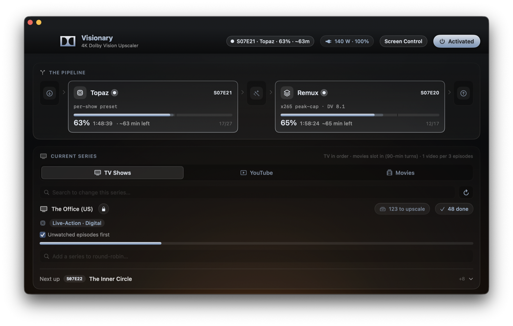
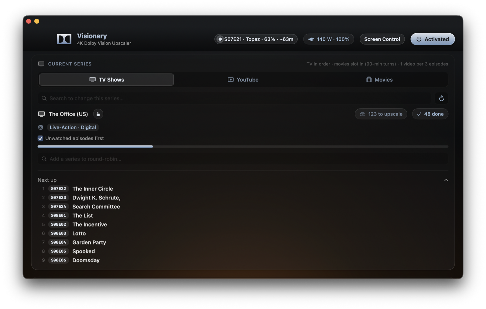
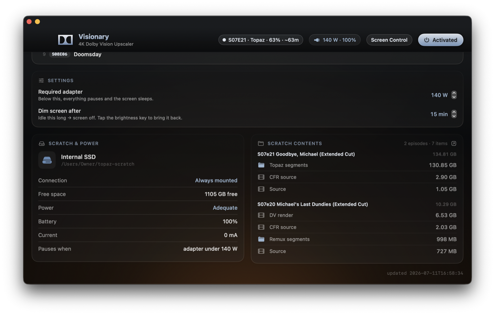

<p align="center">
  
</p>

**An overnight appliance that upscales your TV library to 4K Dolby Vision.**
Topaz Video AI → DaVinci Resolve (real Dolby Vision 8.1, not a tone-map) → peak-capped
x265 remux → straight back into your NAS's Plex library, replacing the 1080p original.
Arm it in the evening; wake up to finished episodes.

<p align="center">
  
</p>
<p align="center"><sub><b>Two episodes in flight at once</b> — S07E21 upscaling in Topaz while S07E20's Dolby Vision remux runs beside it, each with its own segmented, resumable progress.</sub></p>

> [!IMPORTANT]
> **Visionary is built for one exact hardware + software combination and refuses to run
> on anything else:**
>
> | Requirement | Exactly |
> |---|---|
> | Mac | **16-inch MacBook Pro** (Apple Silicon), using its **built-in display** (3456×2234) as the main display, on its **140 W power adapter** |
> | DaVinci Resolve | **Studio 18.6.0** (build 18.6.00009) — the paid Studio edition, this exact build |
> | Topaz Video AI | **7.0.1** — this exact build |
> | NAS | reachable over FTP, hosting your media + a Plex server |
>
> Why the 16-inch specifically — two independent reasons:
> 1. **The display.** The Resolve stage drives the *real* Resolve UI by screen-capture
>    template matching and synthetic clicks (Dolby Vision's "Analyze All Shots" has no
>    scripting API). The templates and click coordinates were captured from this exact
>    Resolve build on this exact 3456×2234 panel — any other version or screen silently
>    breaks the automation.
> 2. **The power.** The Topaz stage runs the GPU flat-out for hours and needs the 16-inch
>    model's full **140 W** power envelope. The 14-inch MacBook Pro tops out at a 96 W
>    adapter — the pipeline's power gate would hold forever (and on a lesser brick the
>    battery drains mid-encode).
>
> The app checks versions, display, and power at launch and will not arm on a mismatch.
>
> Resolve Studio and Topaz Video AI are commercial products — bring your own licenses.

## Setup

The main path is manual, below. **Prefer a guided install?** Open [Claude Code](https://claude.com/claude-code)
in your clone and say *"set this up for me"* — the repo ships instructions Claude follows
([CLAUDE.md](CLAUDE.md) + [docs/SETUP-CLAUDE.md](docs/SETUP-CLAUDE.md)).

Each step below has a matching check in the preflight tool — re-run it any time:

```bash
python3 engine/preflight.py          # human output; add --json for machine-readable
```

### 1. Hardware gate (do this first)

```bash
git clone https://github.com/adamkbritsch/visionary.git
cd visionary && python3 engine/preflight.py
```

If the `display` check fails, **stop here** — this machine can't run Visionary
(see the requirements box above). Nothing you install later will change that.

### 2. Install the two apps — exact versions

- **DaVinci Resolve Studio 18.6** — from Blackmagic's
  [support archive](https://www.blackmagicdesign.com/support/family/davinci-resolve-and-fusion)
  (expand "Older versions"). Install, enter your Studio license, launch it once, quit.
  **Never accept an in-app upgrade** or let a newer Resolve touch its project library.
- **Topaz Video AI 7.0.1** — from Topaz's
  [release archive](https://community.topazlabs.com/c/video-ai/releases). Install, log in
  once in the app (that activates the license + downloads models; the pipeline runs it
  headlessly afterwards), then **disable auto-updates** in its preferences and quit.

### 3. Command-line tools

```bash
brew install ffmpeg x265 dovi_tool gpac cliclick
brew install --cask sublercli
softwareupdate --install-rosetta --agree-to-license   # SublerCLI is x86_64
```

### 4. Python dependency (for the SYSTEM python)

```bash
/usr/bin/python3 -m pip install --user opencv-python
# if pip is missing: /usr/bin/python3 -m ensurepip --user && retry
```

The app launches its engine with `/usr/bin/python3` specifically (Resolve's scripting
API requires Python ≤ 3.11) — installing into a conda/homebrew Python won't help.

### 5. Re-run preflight

```bash
python3 engine/preflight.py
```

Everything should pass except `tcc_grants`, `resolve_artifacts`, and `config` — those
are the next three steps.

### 6. Build, launch, grant permissions

```bash
bash macapp/setup-signing-cert.sh   # one-time: local signing cert (grants survive rebuilds)
bash macapp/build.sh
open Visionary.app
```

In the app, click **Request Accessibility**, then System Settings → Privacy & Security →
enable **Visionary** under both **Screen Recording** and **Accessibility**. Relaunch the
app. Verify: `curl -s http://127.0.0.1:8765/api/selftest` shows both grants true.

### 7. Import the Resolve projects + DV render preset

Quit Resolve if it's open, then:

```bash
/usr/bin/python3 setup/import_resolve.py
```

This merges the **OvernightDV** render preset (it carries the Dolby Vision 8.1 profile —
the one setting with no scripting API) into your global preset list, launches Resolve,
imports the two persistent projects (SDR + HDR intake) from `bundle/resolve/`, and
verifies both. Optional: import `bundle/topaz/*.json` in Topaz's GUI (File → Import
preset) — reference only; the pipeline embeds its Topaz parameters.

### 8. Configure

```bash
mkdir -p ~/.topaz-pipeline
cp config.example.json ~/.topaz-pipeline/config.json
chmod 600 ~/.topaz-pipeline/config.json
```

Fill in ([Configuration](#configuration) below): NAS FTP host(s) + credentials, Plex URL +
token ([how to find your token](https://support.plex.tv/articles/204059436-finding-an-authentication-token-x-plex-token/)),
optional TMDb key, optional youtarr.

### 9. NAS check

```bash
python3 engine/preflight.py --network
```

FTP must connect and Plex must answer. Optional NAS extras: [nas/dv_probe.py](nas/README.md)
(precise Dolby Vision detection for pre-existing DV content) and
[youtarr](https://github.com/DialmasterOrg/Youtarr) (enables the YouTube mode — without it
that mode simply stays off).

### 10. Final verification + first run

```bash
python3 engine/preflight.py --network --post-setup
```

All green → open Visionary, pick a show, press **Activate**, and watch one episode flow
through download → topaz → resolve → remux → upload. The first resolve stage takes the
screen for ~10-15 minutes — that's the Dolby Vision analysis (there's a Screen Control
button to defer it while you're using the Mac).

## How it works

```
NAS (FTP) ──download──▶ local scratch
                          │  Topaz Video AI (bundled ffmpeg, prob-4) — 1080p → 4K ProRes chunks
                          ▼
                        DaVinci Resolve Studio (scripted + screen automation)
                          │  scene cuts → Dolby Vision "Analyze All Shots" → DV 8.1 render
                          ▼
                        remux — x265 re-encode under a hard peak-bitrate cap (native DV RPU),
                          │  original audio folded back + smart loudness boost, hvc1 mp4
                          ▼
NAS (FTP) ◀──upload─── finished 4K DV master REPLACES the 1080p original in Plex
```

- **Smart upscaling profiles**: it detects how a title was actually made — **film, digital,
  or animation (2D vs CGI)** — by consulting TMDb (animation + technique) and ShotOnWhat
  (live-action film vs digital), then picks the matching tuned Topaz profile automatically,
  with per-resolution variants for 480p/720p/1080p sources. No confident match → it asks
  once, and every choice is overridable per show.
- **Two things at once**: the heavy stages overlap — episode N's remux runs while episode
  N+1 is already in Topaz (both segmented + resumable; a deploy or power loss costs at
  most one ~5-minute segment). Measured on real episodes, the overlap cuts a finished
  episode from ~3h12m to ~2h20m — **~27% faster (≈52 minutes saved per episode)**.
- **Appliance mode**: once Activated it re-arms itself across launches and stops; it
  pauses on battery and dims the screen after idle. **Screen Control** holds the
  screen-invasive Resolve stage so it never grabs your Mac while you're using it — the
  other stages keep running. Separately, it pauses its NAS precaching whenever a Plex
  stream is live, so pulling ahead can't stutter playback.
- **TV + Movies** are the core; **YouTube mode** is optional (requires youtarr on the NAS).

| Round-robin queue | Guardrails |
|:---:|:---:|
|  |  |
| <sub>Pick shows, keep <b>unwatched first</b>, round-robin several series; movies and YouTube slot in on their own cadence.</sub> | <sub>The <b>140 W power gate</b> and idle screen-off, plus live per-episode scratch usage (Topaz segments, DV render, remux segments).</sub> |

## Configuration

`~/.topaz-pipeline/config.json` (never committed; `chmod 600`). Every key has an env-var
override (env wins):

| config key | env override | what |
|---|---|---|
| `ftp_hosts` / `ftp_host` | `TOPAZ_NAS_FTP_HOST` | NAS host(s), tried in order (VPN IP first, then LAN name) |
| `ftp_port` | `TOPAZ_NAS_FTP_PORT` | FTP port (default 21) |
| `ftp_user` / `ftp_pass` | `TOPAZ_NAS_FTP_USER` / `_PASS` | FTP credentials |
| `plex_url` / `plex_urls` | `TOPAZ_PLEX_URL` | Plex server URL(s); defaults to the NAS hosts on :32400 |
| `plex_token` | `TOPAZ_PLEX_TOKEN` | your X-Plex-Token |
| `plex_tv_section` / `plex_movie_section` | `TOPAZ_PLEX_SECTION` / `TOPAZ_PLEX_MOVIE_SECTION` | optional — auto-discovered when empty |
| `tmdb_api_key` | `TOPAZ_TMDB_KEY` | optional — richer show metadata |
| `youtarr_url` / `youtarr_user` / `youtarr_pass` | `TOPAZ_YOUTARR_URL` / `_USER` / `_PASS` | optional — YouTube mode |
| `youtube_client_id` / `_secret` / `_refresh_token` | — | optional — YouTube subscriptions picker |

Media roots default to `/Media/TV-Shows`, `/Media/Movies`, `/Media/YouTube` (+ multi-volume
variants); override with `TOPAZ_NAS_FTP_TV`, `TOPAZ_NAS_FTP_MOVIES`, `TOPAZ_NAS_FTP_YOUTUBE`
(and `..._ROOTS` comma-lists) if your share layout differs.

## Repo map

| path | what |
|---|---|
| `engine/` | the Python pipeline (orchestrator, stages, preflight, dashboard server) |
| `macapp/` | the SwiftUI app + build/signing scripts |
| `bundle/` | the shipped Resolve projects, DV render preset, Topaz presets |
| `setup/` | new-machine import tooling (`import_resolve.py`) |
| `nas/` | optional NAS-side helper (`dv_probe.py`) |
| `tools/` | maintainer-only (artifact export) |
| `resolver/` | optional NAS-side show-manifest tool |
| `deploy-now.sh` | redeploy the app at a safe pipeline boundary |

## Known limitations

- One hardware target (see the requirements box) — by design, not laziness: the DV
  analysis step is screen automation and pixel-exact.
- Replaces originals: the finished 4K DV master **overwrites the 1080p source** in your
  library (that's the point — keep backups if you want a way back).
- The youtarr integration assumes a UGREEN-style docker layout for its FTP archive path
  (env-overridable).

## Legal

© 2026 Adam Britsch. Resolve, Topaz Video AI, Plex, and Dolby Vision are trademarks of
their respective owners; you must own licenses for the commercial apps.
Use this only on content you legally own.

---

<p align="center">
  
</p>
