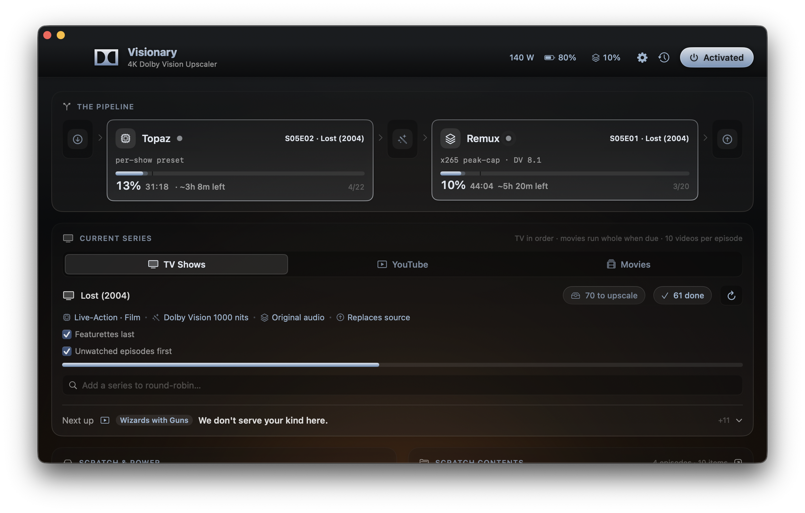
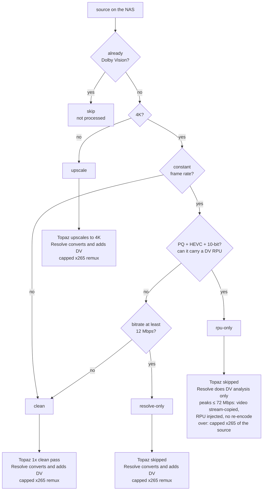
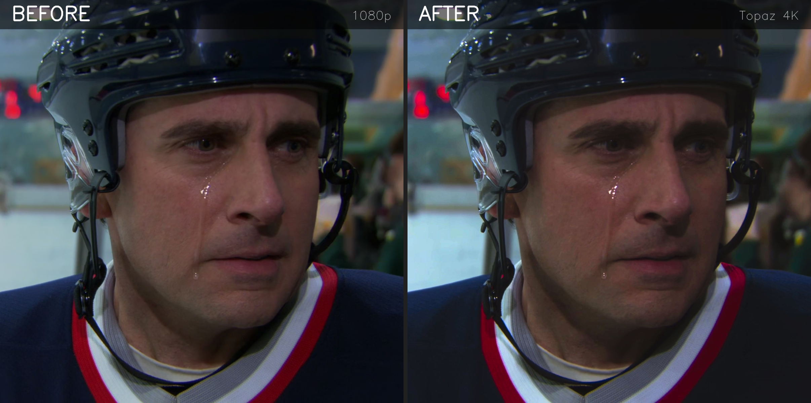
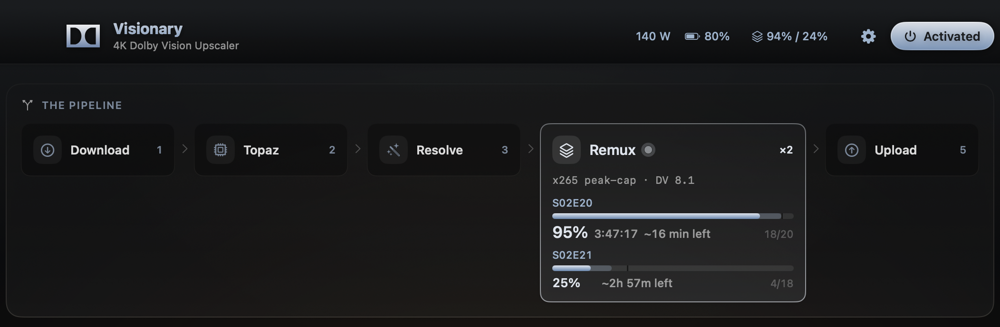
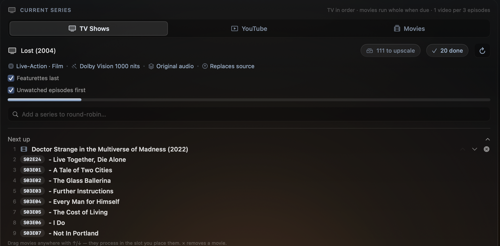
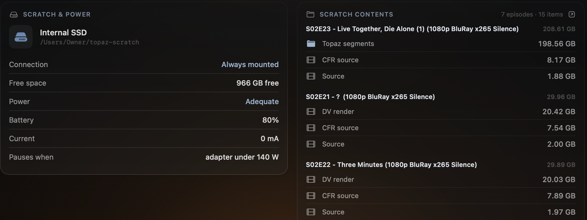
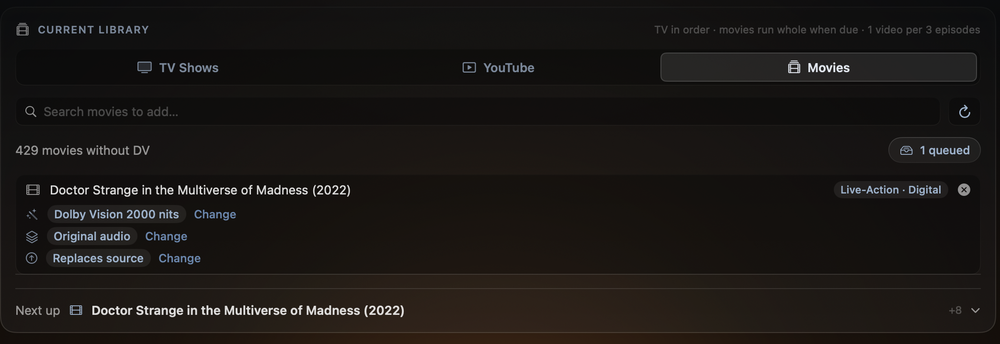
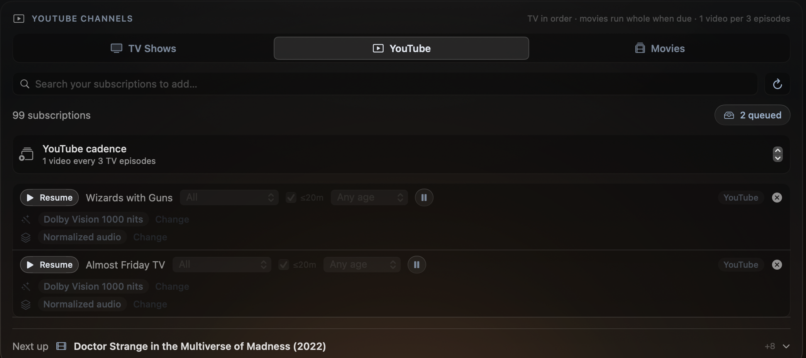
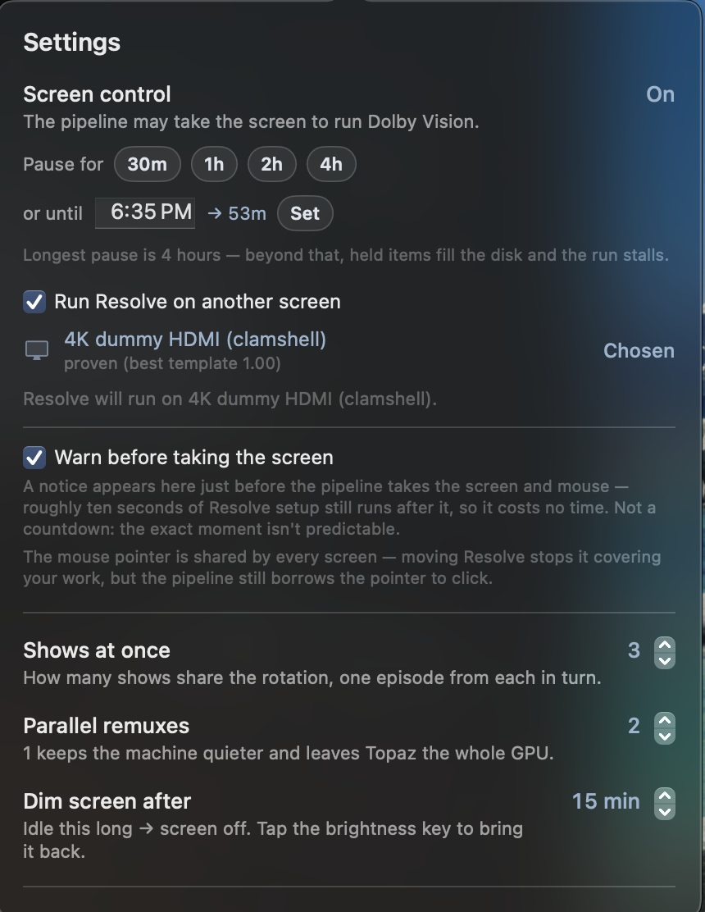

<p align="center">
  
</p>

**An overnight appliance that upscales your TV library to 4K Dolby Vision.**
Topaz Video AI → DaVinci Resolve (real Dolby Vision 8.1, not a tone-map) → peak-capped
x265 remux → straight back into your NAS's Plex library, replacing the 1080p original.
Arm it in the evening; wake up to finished episodes.

<p align="center">
  
</p>
<p align="center"><sub><b>Two episodes in flight at once</b> — S07E21 upscaling in Topaz while S07E20's Dolby Vision remux runs beside it, each with its own segmented, resumable progress.</sub></p>

> [!IMPORTANT]
> **Visionary drives the DaVinci Resolve interface by looking at the screen, and runs the
> GPU flat out for hours.** It checks your hardware at launch and won't start if it can't
> work properly. What it needs:
>
> | Requirement | What works |
> |---|---|
> | Mac | **Any desktop Mac** (mini, Studio, iMac), or a **16-inch MacBook Pro** on its 140 W charger. A 14-inch MacBook Pro (M1/M2) or a MacBook Air can't sustain the power draw and is refused; a laptop too new for the model lists is judged by its live charger reading instead (see below). |
> | Display | Any **Retina / HiDPI** screen: a Mac laptop's built-in panel, or a **4K or 5K monitor** on its normal (scaled) setting. A **4K dummy HDMI plug** also counts — that's how you run it with the lid closed. A monitor switched to "More Space" is refused. |
> | DaVinci Resolve | **Studio 18.6.0** (build 18.6.00009) — the paid Studio edition, this exact build |
> | Topaz Video AI | **7.0.1** — this exact build |
> | Local scratch | a **fast SSD with ~1 TB free** — the working files are enormous (see [Known limitations](#known-limitations)) |
> | NAS | reachable over FTP, hosting your media (a Plex server is **optional** — see [Configuration](#configuration)) |
>
> **Why the display rule?** Dolby Vision's "Analyze All Shots" button can't be clicked by
> script, so Visionary finds it by matching a picture of the button against the screen.
> Every Retina screen draws that button at the same size, so it works on any of them —
> the monitor's size and shape barely matter (anything at least 1280×720 points: every
> real 4K/5K or built-in panel qualifies, while a 1080p dummy plug is too small). A non-Retina mode draws everything at half
> size, and nothing matches. Only the 16-inch built-in panel and a 4K dummy plug have been
> tested end to end — on any other screen, run `python3 engine/preflight.py --smoke` once
> to confirm Visionary can see Resolve's buttons.
>
> **Why the power rule?** Topaz pushes the GPU for hours. A desktop Mac is plugged into the
> wall, so it always qualifies. A laptop is judged by its model rather than by the charger
> you plugged in — because a 140 W charger connected to a laptop that can only draw 96 W
> still reports "140 W". A laptop too new to be on the list isn't blocked: Visionary falls
> back to checking the charger, and warns.
>
> Resolve Studio and Topaz Video AI are commercial products — bring your own licenses.

## Install

The easy path — no clone, no Terminal for most of it:

1. **Download** the latest `Visionary-vX.zip` from
   [Releases](https://github.com/adamkbritsch/visionary/releases) and unzip it.
2. **Drag Visionary.app to /Applications.** This step is required, not cosmetic: macOS
   runs a quarantined app opened elsewhere from a randomized read-only path (App
   Translocation), and the privacy grants wouldn't stick.
3. **Right-click → Open** the first time (the app isn't notarized; macOS asks once).
4. Install the two commercial apps — **DaVinci Resolve Studio 18.6.0** and **Topaz
   Video AI 7.0.1**, exact builds, links in step 2 of the manual path below. These are
   licensed software; the app detects them but can't install them for you.
5. Open the **gear → Settings → Setup** section. Everything else lives there, with a
   live check beside each item: your NAS connection (and the optional Plex / TMDb /
   youtarr / Shuttle fields), **one-click installs** for the command-line dependencies,
   both **privacy permission prompts**, the **Resolve projects + DV preset import**
   (quit Resolve first), and the optional NAS DV-probe helper with its cron line. The
   section stays expanded until every check is green, then tucks itself away.

The pipeline won't arm until the hardware gate passes (see the requirements box above)
and the dependencies exist — and it names exactly what's missing rather than failing
mid-run. The NAS side needs its **FTP service enabled** (System Settings on a UGREEN /
your NAS's file-services panel elsewhere); everything else NAS-side is optional.

## Setup (manual / development path)

The same result from a clone — every step has a matching in-app Setup row and a check in
the preflight tool. **Prefer a guided install?** Open [Claude Code](https://claude.com/claude-code)
in your clone and say *"set this up for me"* — the repo ships instructions Claude follows
([CLAUDE.md](CLAUDE.md) + [docs/SETUP-CLAUDE.md](docs/SETUP-CLAUDE.md)).

```bash
python3 engine/preflight.py          # human output; add --json for machine-readable
```

### 1. Hardware gate (do this first)

```bash
git clone https://github.com/adamkbritsch/visionary.git
cd visionary && python3 engine/preflight.py
```

If the `display` check fails, **stop here** — your main screen isn't a Retina/HiDPI one
(see the box above). Nothing you install later will change that. The usual fixes: switch a
4K monitor from "More Space" back to its normal scaled setting, or plug in a 4K dummy HDMI
plug and close the lid.

### 2. Install the two apps — exact versions&nbsp;&nbsp;<picture><source media="(prefers-color-scheme: dark)" srcset="docs/assets/pirate-ship-white-v2.png"></picture>

- **DaVinci Resolve Studio 18.6** — from Blackmagic's
  [support archive](https://www.blackmagicdesign.com/support/family/davinci-resolve-and-fusion)
  (expand "Older versions"). Install, enter your Studio license, launch it once, quit.
  **Never accept an in-app upgrade** or let a newer Resolve touch its project library.

- **Topaz Video AI 7.0.1** — from Topaz's
  [release archive](https://community.topazlabs.com/c/video-ai/releases). Install, log in
  once in the app (that activates the license + downloads models; the pipeline runs it
  headlessly afterwards), then **disable auto-updates** in its preferences and quit.

### 3. Command-line tools

```bash
brew install ffmpeg x265 dovi_tool gpac cliclick
brew install --cask sublercli
softwareupdate --install-rosetta --agree-to-license   # SublerCLI is x86_64
```

### 4. Python dependency (for the SYSTEM python)

```bash
/usr/bin/python3 -m pip install --user opencv-python
# if pip is missing: /usr/bin/python3 -m ensurepip --user && retry
```

The app launches its engine with `/usr/bin/python3` specifically (Resolve's scripting
API requires Python ≤ 3.11) — installing into a conda/homebrew Python won't help.

### 5. Re-run preflight

```bash
python3 engine/preflight.py
```

Everything should pass except `tcc_grants`, `resolve_artifacts`, and `config` — those
are the next three steps.

### 6. Build, launch, grant permissions

```bash
bash macapp/setup-signing-cert.sh   # one-time: local signing cert (grants survive rebuilds)
bash macapp/build.sh
open Visionary.app
```

In the app, click **Request Accessibility**, then System Settings → Privacy & Security →
enable **Visionary** under both **Screen Recording** and **Accessibility**. Relaunch the
app. Verify: `curl -s http://127.0.0.1:8765/api/selftest` shows both grants true.

### 7. Import the Resolve projects + DV render preset

Quit Resolve if it's open, then:

```bash
/usr/bin/python3 setup/import_resolve.py
```

This merges the **OvernightDV** render preset (it carries the Dolby Vision 8.1 profile —
the one setting with no scripting API) into your global preset list, launches Resolve,
imports the three persistent projects (the DV1000/DV2000 Dolby Vision outputs + the
SDR output) from `bundle/resolve/`, and verifies them. Optional: import `bundle/topaz/*.json` in Topaz's GUI (File → Import
preset) — reference only; the pipeline embeds its Topaz parameters.

### 8. Configure

```bash
mkdir -p ~/.topaz-pipeline
cp config.example.json ~/.topaz-pipeline/config.json
chmod 600 ~/.topaz-pipeline/config.json
```

Fill in ([Configuration](#configuration) below): NAS FTP host(s) + credentials, and — all
optional — a Plex URL + token ([how to find it](https://support.plex.tv/articles/204059436-finding-an-authentication-token-x-plex-token/)),
a TMDb key, and youtarr.

### 9. NAS check

```bash
python3 engine/preflight.py --network
```

FTP must connect; Plex, if you configured it, must answer (it's optional). Optional NAS extras: [nas/dv_probe.py](nas/README.md)
(precise Dolby Vision detection for pre-existing DV content) and
[youtarr](https://github.com/DialmasterOrg/Youtarr) (enables the YouTube mode — without it
that mode simply stays off).

### 10. Final verification + first run

```bash
python3 engine/preflight.py --network --post-setup
```

All green → open Visionary, pick a show, press **Activate**, and watch one episode flow
through download → topaz → resolve → remux → upload. The first resolve stage takes the
screen for ~10-15 minutes — that's the Dolby Vision analysis (there's a Screen Control
button to defer it while you're using the Mac).

## How it works

```
NAS (FTP) ──download──▶ local scratch
                          │  Topaz Video AI (bundled ffmpeg, prob-4) — 1080p → 4K ProRes chunks
                          ▼
                        DaVinci Resolve Studio (scripted + screen automation)
                          │  scene cuts → Dolby Vision "Analyze All Shots" → DV 8.1 render
                          ▼
                        remux — x265 re-encode under a hard peak-bitrate cap (native DV RPU),
                          │  original audio folded back + smart loudness boost, hvc1 mp4
                          ▼
NAS (FTP) ◀──upload─── finished 4K DV master REPLACES the source (default) or lands
                       NEXT TO it — per-show/movie "Replaces source" setting; keeping
                       both makes Plex serve them as one item with two versions
```

### Which path a source takes

Every source is ffprobed (`engine/plan.py`), and the measurements — not the filename —
decide the route. The probe always reads the untouched original, never the CFR intermediate,
so a VFR source can't sneak into a fast path via its CFR copy. The filename is only ever used
for the *suggestion* shown in the app before a file has been downloaded.


```mermaid
flowchart TD
    S["source on the NAS"] --> DV{"already<br/>Dolby Vision?"}
    DV -->|yes| SKIP["skip<br/>not processed"]
    DV -->|no| FOURK{"4K?"}
    FOURK -->|no| UPS["upscale"]
    FOURK -->|yes| CFR{"constant<br/>frame rate?"}
    CFR -->|no| CLEAN["clean"]
    CFR -->|yes| RPU{"PQ + HEVC + 10-bit?<br/>can it carry a DV RPU"}
    RPU -->|yes| INJ["rpu-only"]
    RPU -->|no| BR{"bitrate at least<br/>12 Mbps?"}
    BR -->|yes| CONV["resolve-only"]
    BR -->|no| CLEAN

    INJ --> INJ2["Topaz skipped<br/>Resolve does DV analysis only<br/>peaks &le; 72 Mbps: video stream-copied,<br/>RPU injected, no re-encode<br/>over: capped x265 of the source"]
    CONV --> CONV2["Topaz skipped<br/>Resolve converts and adds DV<br/>capped x265 remux"]
    CLEAN --> CLEAN2["Topaz 1x clean pass<br/>Resolve converts and adds DV<br/>capped x265 remux"]
    UPS --> UPS2["Topaz upscales to 4K<br/>Resolve converts and adds DV<br/>capped x265 remux"]
```

| source | Topaz | Resolve | remux | video re-encoded? |
|---|---|---|---|---|
| 4K HDR10 · HEVC · 10-bit | skipped | DV analysis only, 1000 nits | RPU injected onto the original | **no — bit-identical** (video peaks ≤ 72 Mbps; hotter sources take the capped x265 instead — see below) |
| 4K HDR · HLG/AV1/H.264/8-bit ≥ 12 Mbps | skipped | converts + DV, 1000 nits | capped x265 | yes — DV 8.1 needs an HEVC PQ base |
| 4K SDR ≥ 12 Mbps | skipped | adds HDR + DV, 1000 nits | capped x265 | yes |
| 4K, VFR or under threshold | 1× clean pass | adds (HDR+)DV | capped x265 | yes |
| 1080p and below | upscale to 4K | adds (HDR+)DV, 1000 nits | capped x265 | yes |
| already Dolby Vision | — | — | — | filtered out of the queue up front; a slip-through is refused at the Topaz stage — never mastered or uploaded |

The nit ceiling is **1000 by default on every path** — the 2000-nit target exists but is
manual-only, set per show, movie or channel (as is the true-SDR output).

<p align="center">
  
</p>
<p align="center"><sub><b>1080p source vs Visionary's 4K master</b> — same frame, cropped equally (colour-matched to isolate the resolution gain; the master is also Dolby Vision).</sub></p>

- **Smart upscaling profiles**: it detects how a title was actually made — **film, digital,
  or animation (2D vs CGI)** — by consulting TMDb (animation + technique) and ShotOnWhat
  (live-action film vs digital), then picks the matching tuned Topaz profile automatically,
  with per-resolution variants for 480p/720p/1080p sources. No confident match → it asks
  once, and every choice is overridable per show.

- **Dolby Vision mastering at 1000 nits**: every item is automatically mastered to
  **Dolby Vision at 1000 nits** through a hand-configured Resolve project, whatever the
  intake range. A second **2000-nit** project ships too, but it is **manual-only** — a
  per-show/movie/channel override, never chosen automatically. Both export HDR10 +
  Dolby Vision Profile 8.1.

- **4K fast paths**: a 4K CFR source skips Topaz entirely — its picture is already the
  deliverable. Two tiers, decided by what the stream can technically carry:

  **HDR10 keeps its original bits — up to the Dolby Vision playback ceiling.** A 4K PQ /
  HEVC / 10-bit source keeps its **original video bits**, and Resolve runs purely as a
  Dolby Vision analyser: its render is discarded and only the RPU is injected onto the
  original with `dovi_tool`, at any 4K geometry (2.39:1 scope and DCI 4K included). The
  coded pictures come out bit-identical; only the container and NAL scaffolding are
  rebuilt. One gate applies: players that choke on high-bitrate single-layer DV (the
  SHIELD stutters above ~80 Mbps **whole-stream** with DV engaged, though it direct-plays
  non-DV at 121 — and lossless TrueHD audio rides another 4–8 Mbps above the video, so a
  file that plays fine bare can be pushed over purely by injecting the RPU and muxing
  Atmos in). The remux therefore measures the source's 1-second video peaks first: at or
  under **72 Mbps** (80 minus TrueHD headroom — every output is budgeted as if it carries
  TrueHD) the stream ships untouched; over it, the source video takes the same
  enforced-VBV capped x265 native-DV re-encode as every other path, scene-cut segmented
  and resumable.

  **Everything else 4K** at or above the `passthrough_min_mbps` setting (default **12 Mbps**)
  ships Resolve's HDR+DV conversion through the normal capped remux. Eligibility there is
  purely measured — nothing is excluded by provenance, so a 4K YouTube VP9 qualifies on its
  numbers. Either way a movie lands in **~2.5× its runtime** instead of ~5×.

  An HDR source that *cannot* carry an RPU — HLG, AV1, H.264 or 8-bit — has to be converted
  to gain Dolby Vision at all, since DV 8.1 requires an HEVC PQ 10-bit base layer. That is
  the one case where HDR material is re-encoded, and the plan says which property forced it
  rather than doing it silently.

- **Companion combine** (needs [Shuttle](https://github.com/adamkbritsch/shuttle)'s relay):
  when a second copy of a movie sits on your seedbox, Visionary pairs the two and builds
  ONE best-of MKV — the genuinely better HDR10 video (an **IMAX edition wins outright**:
  more picture beats every other signal), a **real (studio) Dolby Vision RPU**
  from whichever copy carries one (grafted across releases with `dovi_tool`; Profile 7
  Blu-ray metadata is converted to 8.1, and real DV always beats a Resolve analysis), and
  the best lossless audio (**TrueHD Atmos** ranks first — the donor's compat AC-3 rides
  along). The movie list also shows already-DV titles — but only the ones a combine can
  still improve: a background sweep checks the seedbox, and a DV movie appears **only when
  a counterpart exists there and its audio isn't already Dolby Atmos** (goal reached =
  nothing to gain = not listed). Every
  choice is shown on a **verdict card** you approve before anything runs; the seedbox copy
  streams straight through the relay (never staged on the NAS, never modified — it keeps
  seeding), and the combined master obeys the same playback peak budget as every other
  output, taking the capped re-encode (real RPU preserved) when the winner's peaks bust it.

- **Two things at once**: the heavy stages overlap — episode N's remux runs while episode
  N+1 is already in Topaz (both segmented + resumable; a deploy or power loss costs at
  most one ~5-minute segment). Measured on real episodes, the overlap cuts a finished
  episode from ~3h12m to ~2h20m — **~27% faster (≈52 minutes saved per episode)**. Those are
  the ~30-minute extended-cut episodes in the test library; that's about **4.9 minutes of
  wall-clock per minute of content**, so a standard **20-minute 1080p episode** comes out a
  finished 4K Dolby Vision master in **roughly 1h35m** (measured median across 65 finished
  episodes). And if two finished upscales are ever waiting at once, **both remux in
  parallel** on a second lane (Topaz pauses until a lane frees, so the two x265 encodes
  get the machine). High-bitrate fast-path items don't serialize either: while one is
  remuxing, the next item starts — its Resolve included, fast-path or full pipeline.
  Resolve always gets the whole machine: the in-flight remuxes are **suspended outright**
  the instant it starts (SIGSTOP, so they use no CPU) and resume exactly where they were —
  no lost work, and no waiting for a segment boundary. Simultaneous remuxes stay capped at
  two.

<p align="center">
  
</p>
<p align="center"><sub><b>Both remux lanes live</b> — each names its own episode and carries its own progress, segment counter and ETA; the header readout shows both at once. Lane 2 shows no elapsed clock because the engine keeps that bookkeeping on lane 1 only.</sub></p>

- **Storage-smart output**: the remux stage re-encodes the multi-gigabyte Resolve render
  under a hard peak-bitrate cap (x265 with a 50 Mbps ceiling on any one second), so a finished 4K
  Dolby Vision master averages **~1.4 GB — only ~1.7× the ~0.8 GB 1080p source**
  (measured across 48 upscaled episodes). A per-show/movie **"Replaces source"** setting
  decides the source's fate: replace (default — deleted only after the master
  size-verifies on the NAS) or keep it beside the master, where Plex serves both as one
  item with two versions and the source stays re-runnable by future, better models.
  If a master still measures over the cap, the remux **repairs itself**: it localizes the
  offending second(s), re-encodes only those segments at a tighter cap (85%, then 70%),
  and re-gates — instead of failing on identical retries.

- **Appliance mode**: once Activated it re-arms itself across launches and stops; it
  pauses on battery and dims the screen after idle. **Screen Control** holds the
  screen-invasive Resolve stage so it never grabs your Mac while you're using it — the
  other stages keep running. If you have a second display, Resolve can be sent to it
  instead, so the stage stops covering your work at all; the pointer is still borrowed
  for a few seconds per episode, and a notice on your main screen says so before it
  happens. Separately, it pauses its NAS precaching whenever a Plex stream is live, so
  pulling ahead can't stutter playback.

- **TV + Movies** are the core; **YouTube mode** is optional (requires youtarr on the NAS).

| Round-robin queue | Guardrails |
|:---:|:---:|
|  |  |
| <sub>Pick shows, keep <b>unwatched first</b>, round-robin several series; movies and YouTube slot in on their own cadence. While the pipeline is armed the per-item settings condense to <b>one line</b> — they can't change mid-run — but you can still queue more work, and drag a movie to whichever slot you want it to run in.</sub> | <sub>The <b>140 W power gate</b> and free-space headroom, plus live per-episode scratch usage broken out by artefact (Topaz segments, DV render, CFR source, source).</sub> |

| Movies | YouTube |
|:---:|:---:|
|  |  |
| <sub>Movies run whole when they come due. Each one shows its <b>resolved</b> output mode rather than "auto" — everything lands on <b>1000 nits</b> unless pinned otherwise (2000-nit is manual-only), and an HDR10 source keeps its original bits (unless its peaks breach the DV playback ceiling). The count is how many of your library's titles still have no DV.</sub> | <sub>Optional. Pulls from your own subscriptions and slots videos in on a cadence (<b>1 per 3 TV episodes</b>), with per-channel length and age filters. Channels can be paused individually.</sub> |

<p align="center">
  
</p>
<p align="center"><sub><b>Settings.</b> Screen Control can be paused for a fixed span or until a wall-clock time (4 hours max — past that the scratch disk fills and the run stalls). <b>Run Resolve on another screen</b> lists every display that can host it, ranked, with the smoke-tested match score for each.</sub></p>

## Configuration

`~/.topaz-pipeline/config.json` (never committed; `chmod 600`). Most keys have an env-var
override (env wins); keys marked — have no env override:

| config key | env override | what |
|---|---|---|
| `ftp_hosts` / `ftp_host` | `TOPAZ_NAS_FTP_HOST` | NAS host(s), tried in order (VPN IP first, then LAN name) |
| `ftp_port` | `TOPAZ_NAS_FTP_PORT` | FTP port (default 21) |
| `ftp_user` / `ftp_pass` | `TOPAZ_NAS_FTP_USER` / `_PASS` | FTP credentials |
| `plex_url` / `plex_urls` | `TOPAZ_PLEX_URL` | **optional** (see note below) — Plex server URL(s); defaults to the NAS hosts on :32400 |
| `plex_token` | `TOPAZ_PLEX_TOKEN` | **optional** — your X-Plex-Token |
| `plex_tv_section` / `plex_movie_section` | `TOPAZ_PLEX_SECTION` / `TOPAZ_PLEX_MOVIE_SECTION` | optional — auto-discovered when empty |
| `tmdb_api_key` | `TOPAZ_TMDB_KEY` | optional — richer show metadata |
| `youtarr_url` / `youtarr_user` / `youtarr_pass` | `TOPAZ_YOUTARR_URL` / `_USER` / `_PASS` | optional — YouTube mode |
| `youtarr_archive` | `TOPAZ_YOUTARR_ARCHIVE` | optional — FTP path to youtarr's yt-dlp download archive (`complete.list`); defaults to the UGREEN docker layout `/docker/youtarr/config/complete.list` |
| `youtube_client_id` / `_secret` / `_refresh_token` | — | optional — YouTube subscriptions picker |
| `shuttle_relay_url` | — | optional — [Shuttle](https://github.com/adamkbritsch/shuttle) relay base URL (e.g. `http://nas:8789`); enables the movie **companion combine** |
| `shuttle_relay_token` | — | optional — relay bearer token; normally read from Shuttle's own token file in `~/Library/Application Support/Shuttle/` |

> **Plex is optional — you don't need it to run this.** Leave the `plex_*` keys blank and
> everything still works. Show and movie names come from your **NAS folder structure**, not
> Plex, and Plex never decides *what* gets upscaled (that's always "a 1080p file with no 4K
> Dolby Vision master yet"). The token only enables two best-effort extras:
>
> - **Playback failsafe** — while you're streaming from your Plex server, the background
>   prefetch of upcoming downloads pauses so it can't stutter your playback.
>
> - **Watched-first ordering** — an optional per-show toggle (on by default) processes
>   unwatched episodes before watched ones, plus a "watched" badge in the dashboard. Without
>   Plex it just falls back to plain episode order.
>
> Everything degrades gracefully: no token, or an unreachable Plex, just makes these two
> extras inert — the pipeline carries on.

Media roots default to `/Media/TV-Shows`, `/Media/Movies`, `/Media/YouTube` (+ multi-volume
variants); override with `TOPAZ_NAS_FTP_TV`, `TOPAZ_NAS_FTP_MOVIES`, `TOPAZ_NAS_FTP_YOUTUBE`
(and `..._ROOTS` comma-lists) if your share layout differs.

## Repo map

| path | what |
|---|---|
| `engine/` | the Python pipeline (orchestrator, stages, preflight, dashboard server) |
| `macapp/` | the SwiftUI app + build/signing scripts |
| `bundle/` | the shipped Resolve projects, DV render preset, Topaz presets |
| `setup/` | new-machine import tooling (`import_resolve.py`) |
| `nas/` | optional NAS-side helper (`dv_probe.py`) |
| `tools/` | maintainer-only (artifact export) |
| `resolver/` | optional NAS-side show-manifest tool |
| `deploy-now.sh` | redeploy the app at a safe pipeline boundary |

## Known limitations

- One hardware target (see the requirements box) — by design, not laziness: the DV
  analysis step is screen automation and pixel-exact.

- **Resolve's upgrade nag stalls Resolve — not the pipeline.** Every week or so, DaVinci
  Resolve throws an "update available" dialog on launch that blocks its screen automation.
  After a few failed attempts rule out a fluke, the pipeline stops idling: it holds each
  finished upscale *before* Resolve and keeps Topaz-ing the next episodes into a buffer
  (down to a **~100 GB** free-disk floor),
  re-probing Resolve on a timer. Dismiss the prompt whenever you notice — open DaVinci
  Resolve, click it away (or just deactivate/reactivate the pipeline to force an immediate
  retry) — and the whole buffer drains through Resolve automatically, running **two remuxes
  at once** while the backlog is ≥2 items to clear it ~2× faster (Topaz pauses while those
  two x265 encodes run, so the CPU is theirs). Nothing is lost or parked; you just reclaim
  the idle GPU time the stall would've wasted.

- **Enormous working scratch.** The finished master is small (~1.4 GB), but *getting
  there* is not: Topaz's 4K ProRes intermediate is near-lossless, so while an item is
  being upscaled it holds roughly **190 GiB (~205 GB) of scratch** — **over 250× the
  ~0.8 GB source** (re-measured 2026-08-05; a feature film's intermediate can reach
  ~245 GB). That intermediate is **deleted the
  moment Resolve finishes its export** — the remux only needs the DV render plus the
  original — so the item being remuxed alongside the next upscale carries just ~10 GB, and
  the dual pipeline never doubles the peak. A **4K fast-path movie** peaks higher than
  anything with a ProRes stage: its source, CFR copy, DV render, two stream-copy
  transients and the growing master all coexist at the final mux — **live-measured
  317.7 GB** for a 56 GB REMUX. Budget generously: the pipeline keeps a **400 GB
  free-space floor** before starting an item (room for one movie-sized working set plus
  margin), so plan for a fast SSD with ~1 TB free (a 2 TB SSD is comfortable).

- Replaces originals **by default**: once the uploaded 4K DV master size-verifies on the
  NAS, the superseded 1080p source is deleted — but the per-show/movie **"Replaces
  source"** setting can instead keep the source beside the master (Plex merges them
  into one item with two versions and serves the 4K, and the source stays re-runnable
  by future, better upscale models). Keep backups if you want a way back regardless.

## Legal

© 2026 Adam Britsch. Resolve, Topaz Video AI, Plex, and Dolby Vision are trademarks of
their respective owners; you must own licenses for the commercial apps.
Use this only on content you legally own.

---

<p align="center">
  
</p>

<p align="center">
  <sub>Pirate ship icon by <a href="https://thenounproject.com/">Madison Apple</a> from the Noun Project, licensed under <a href="https://creativecommons.org/licenses/by/3.0/">CC&nbsp;BY&nbsp;3.0</a>.</sub>
</p>
